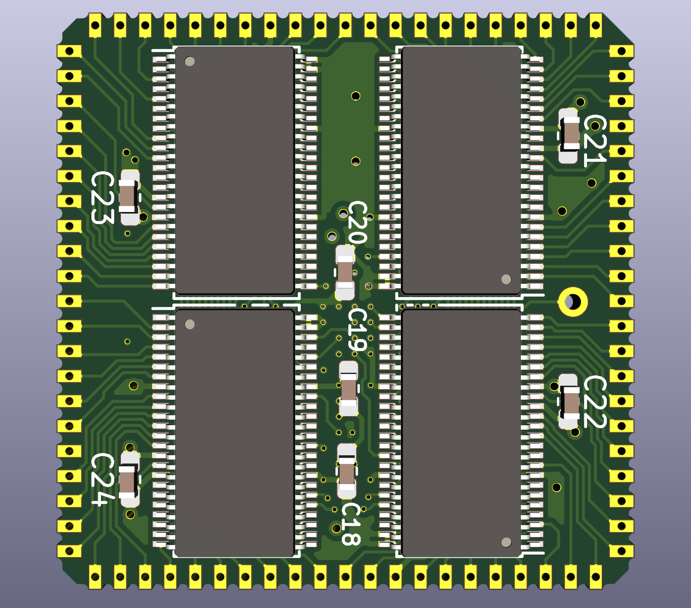
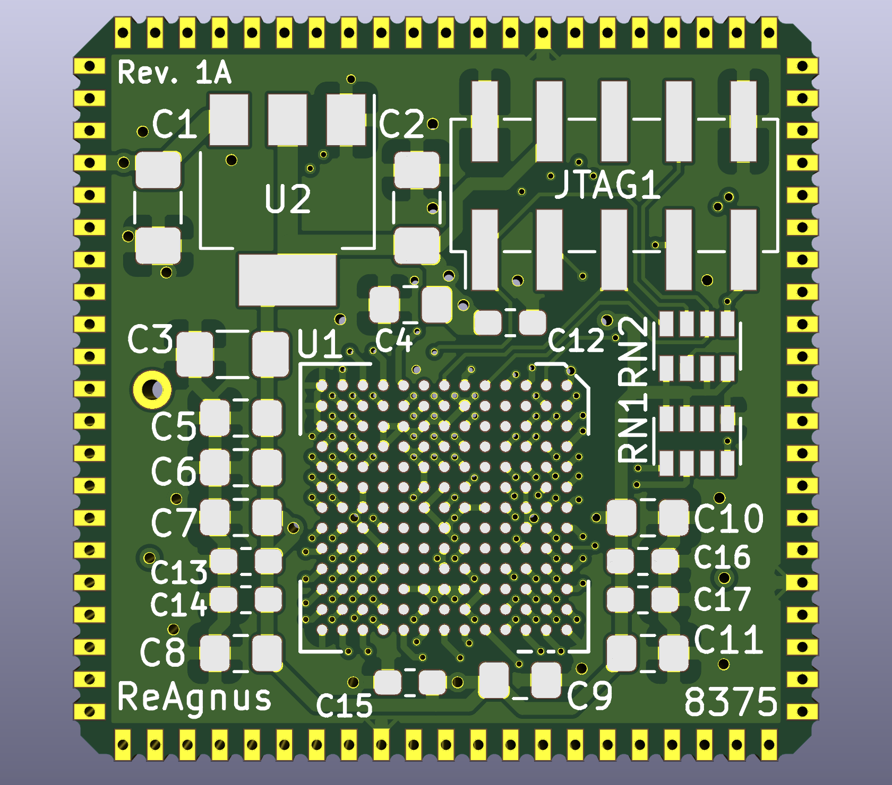
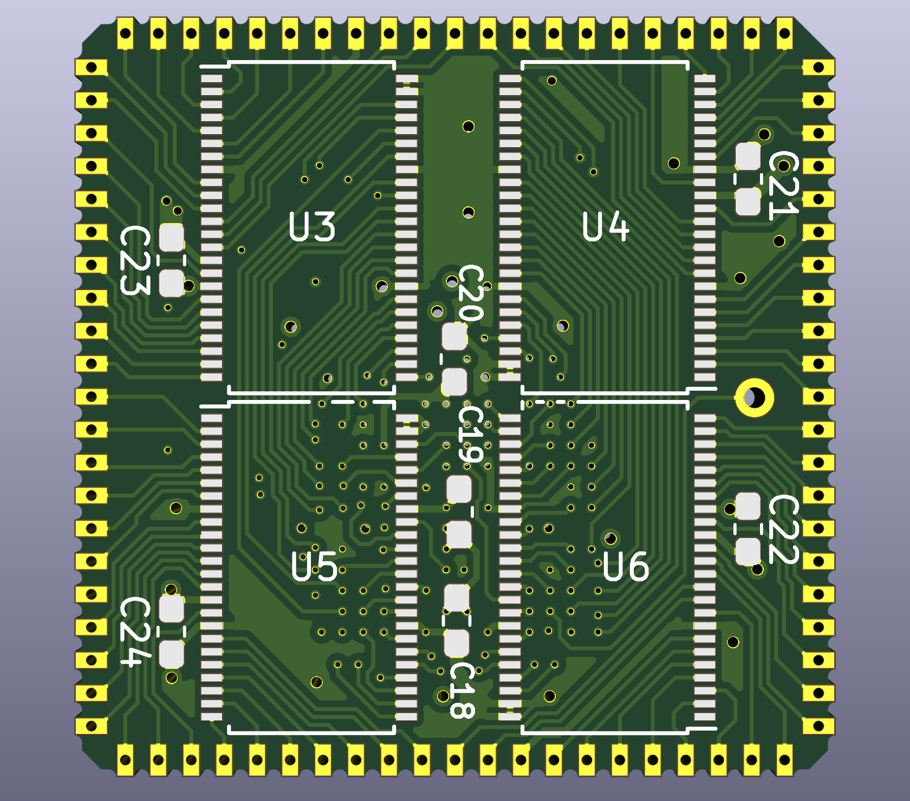
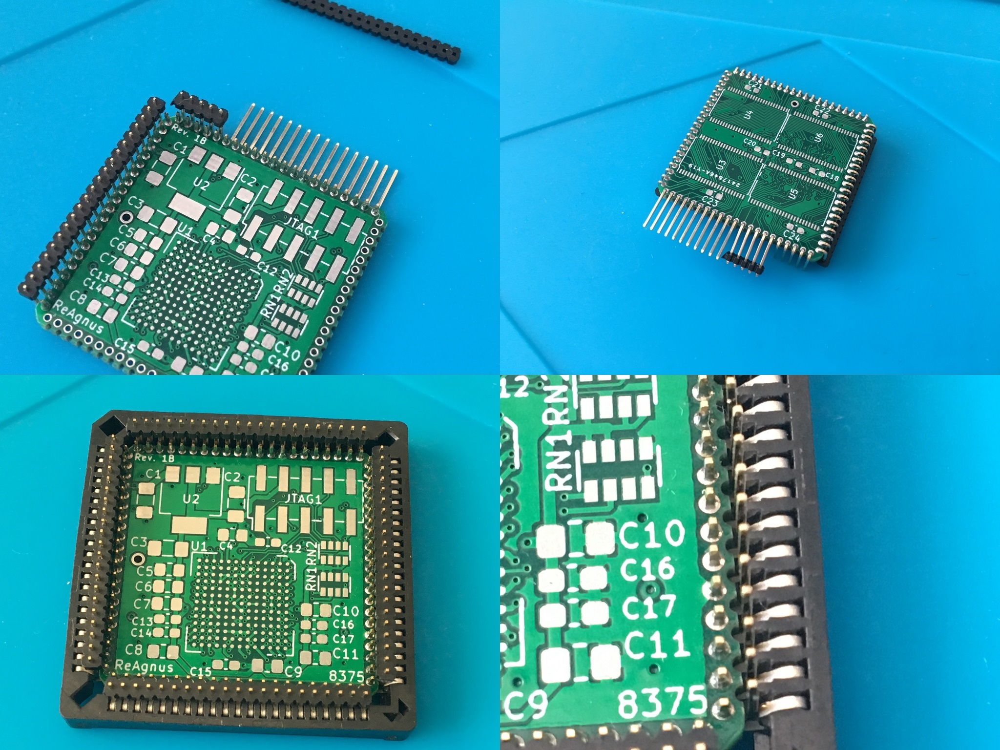
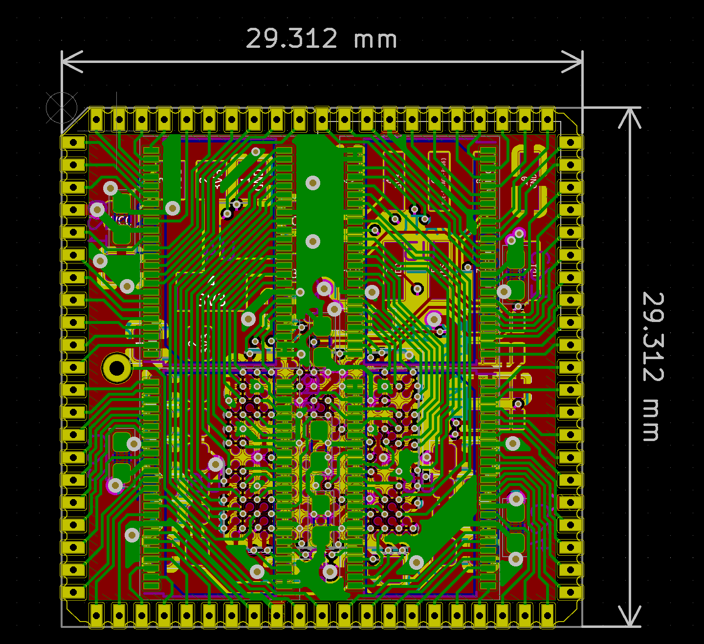

# ReAgnus
A drop-in replacement PCB for the Amiga Agnus chip

This is WORK IN PROGRESS and not tested yet. If you generate gerbers and order PCBs from this source you are doing so completely at your own risk!. It is a  prototype, treat it as such. Current design is a four layer board designed for soldering Pin headers 1.27 mm pitch 4 x 21 single row right angle, 0.4 mm square pins.

 
REV 1A
 

 
REV 1B
 

 

[![CC BY-SA 4.0][cc-by-sa-shield]][cc-by-sa]

This work is licensed under a
[Creative Commons Attribution-ShareAlike 4.0 International License][cc-by-sa].

[![CC BY-SA 4.0][cc-by-sa-image]][cc-by-sa]

[cc-by-sa]: http://creativecommons.org/licenses/by-sa/4.0/
[cc-by-sa-image]: https://licensebuttons.net/l/by-sa/4.0/88x31.png
[cc-by-sa-shield]: https://img.shields.io/badge/License-CC%20BY--SA%204.0-lightgrey.svg
