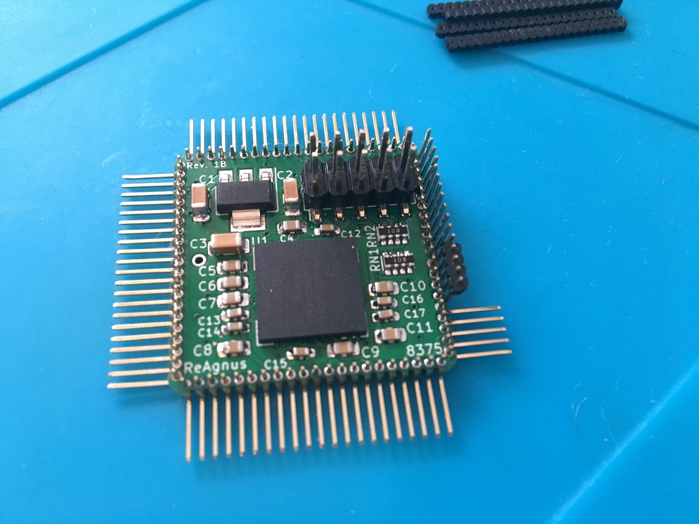
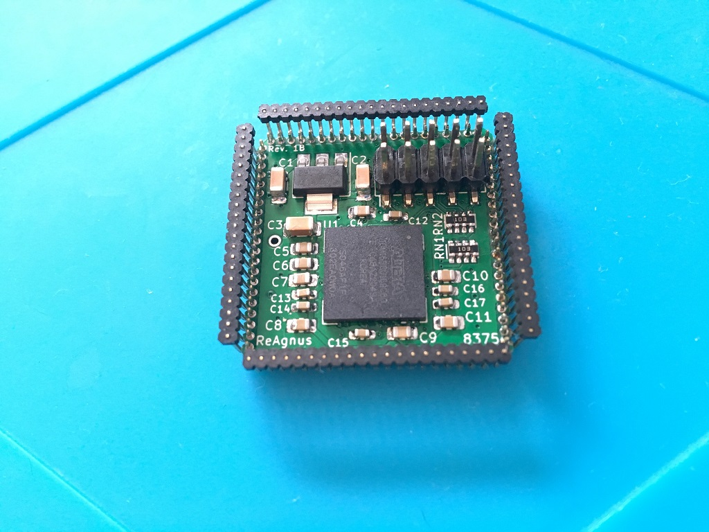
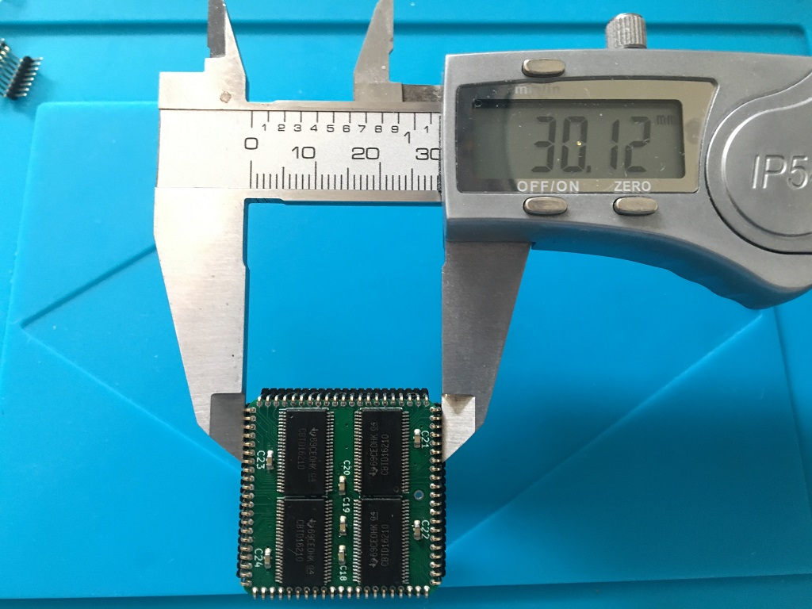

# ReAgnus
A drop-in replacement PCB for the Amiga Agnus chip

This is WORK IN PROGRESS and not tested yet. If you generate gerbers and order PCBs from this source you are doing so completely at your own risk!. It is a  prototype, treat it as such. Current design is a four layer board designed for soldering Pin headers 1.27 mm pitch 4 x 21 single row right angle, 0.4 mm square pins.

 
REV 1A
 

 
REV 1B
 

 

***

 

***

Preliminary BOM Rev. 1B
---------
Position  | Name/Value   | Package | Notes
-|-|-|-|
U1 | 10M02SCU169C8G | BGA-169 11.0x11.0mm_Layout13x13 | FPGA Intel MAX 10
U2 | LM1117-3.3 | SOT-223 | Low-Dropout Linear Regulator 3.3 Volt
U3-U6 | SN74CBTD16210 | TSSOP-48 6.1x12.5mm_P0.5mm | 20-BIT FET Bus switch with level shifting, high-speed TTL-compatible, https://www.ti.com/lit/ds/symlink/sn74cbtd16210.pdf
U7 | PinHeaders | 1.27mm pin pitch | https://www.aliexpress.com/item/32767692043.html
RN1 | CAY16-103J4LF RES ARRAY 4 Resistors 10k Ω | 1206 SMD | https://www.digikey.se/product-detail/sv/bourns-inc/CAY16-103J4LF/CAY16-103J4LFCT-ND/
RN2 | CAY16-103J4LF RES ARRAY 4 Resistors 10k Ω | 1206 SMD | ---"---
C1-3 | Capacitor 10uF | 1206 SMD | 
C4-C11 | Capacitor 0.1uF = 100nF | 0805 SMD | 
C12-C24 | Capacitor 0.01uF = 10nF | 0603 SMD |
JTAG1 | SMT Pin Header Male | SMT 2 x 5 Pin | https://www.aliexpress.com/item/4000123828528.html
 

***

[![CC BY-SA 4.0][cc-by-sa-shield]][cc-by-sa]

This work is licensed under a
[Creative Commons Attribution-ShareAlike 4.0 International License][cc-by-sa].

[![CC BY-SA 4.0][cc-by-sa-image]][cc-by-sa]

[cc-by-sa]: http://creativecommons.org/licenses/by-sa/4.0/
[cc-by-sa-image]: https://licensebuttons.net/l/by-sa/4.0/88x31.png
[cc-by-sa-shield]: https://img.shields.io/badge/License-CC%20BY--SA%204.0-lightgrey.svg
